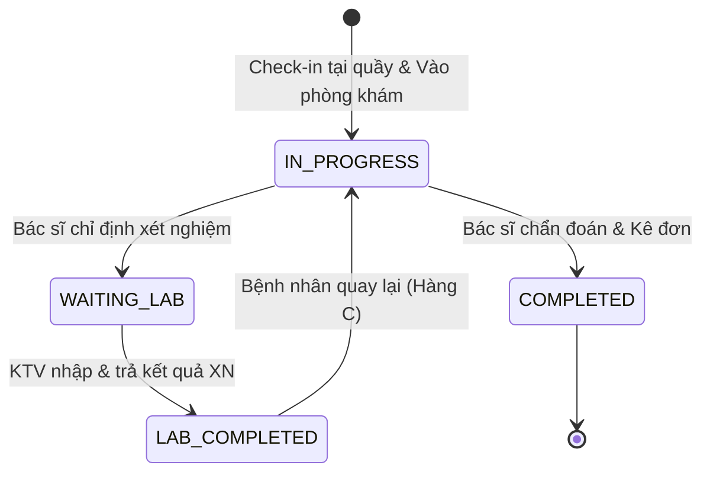

## I. TẠI SAO PHẢI CHỈNH SỬA LOGIC TRƯỚC KHI VẼ MOCKUP FIGMA?

> [!CAUTION]
> **Rủi ro vỡ tiến độ (Rework Risk):**  
> Việc vẽ Mockup Figma ở Bước 7 chính là cụ thể hóa **luồng giao diện và trạng thái màn hình** của Use Case.  
> Nếu tiến hành vẽ Mockup khi Business Rules và Logic hệ thống còn mâu thuẫn (như hàng đợi bị tắc nghẽn, hồ sơ bệnh án bị khóa không xem lại được, thiếu màn hình chờ kết quả xét nghiệm), nhóm sẽ phải **đập đi vẽ lại toàn bộ Figma** và **đổi lại Schema CSDL ở Bước 8**, gây lãng phí 40-50% thời gian của dự án.

---

## II. BẢNG TỔNG HỢP 6 LỖI LOGIC NGHIỆM TRỌNG & HƯỚNG GIẢI QUYẾT

### 1. Mâu thuẫn: Đóng hồ sơ bệnh án vs. Xem lịch sử khám
* **Vấn đề hiện tại:**
  * Tài liệu ghi: *"Bác sĩ & Phòng xét nghiệm hoàn tất khám thì sẽ đóng hồ sơ của bệnh nhân đó và không được xem lại hồ sơ nữa"*.
  * Ngược lại, tính năng Bác sĩ ghi: *"Xem hồ sơ và lịch sử khám của bệnh nhân"*.
  * **Lỗi logic:** Bác sĩ cho bệnh nhân đi làm xét nghiệm, bệnh nhân quay lại phòng khám mang theo kết quả -> Bác sĩ bị khóa hồ sơ, không thể mở ra để xem kết quả và kê đơn! Hoặc bệnh nhân tái khám tuần sau, bác sĩ không có quyền đọc lịch sử bệnh án cũ.
* **Hướng giải quyết (Giải pháp chốt với Nhóm trưởng):**
  * Tách bạch giữa **Trạng thái phiên khám (Visit Status)** và **Quyền truy cập (Access Permission)**:
    * Khi bấm "Hoàn tất khám", phiên khám chuyển trạng thái sang `COMPLETED`.
    * Hành động "Đóng hồ sơ" chỉ là **Khóa quyền sửa (No Update/Write)** để đóng băng dữ liệu y khoa.
    * Bác sĩ vẫn giữ quyền **Xem (Read-Only)** toàn bộ lịch sử các phiên khám cũ của bệnh nhân khi bệnh nhân đó đến khám tại phòng khám/chuyên khoa của bác sĩ.

---

### 2. Mâu thuẫn & Lỗ hổng Thuật toán Xếp hàng (Queue Management)
* **Vấn đề hiện tại:**
  * Quy tắc ghi: *"Khám xen kẽ 1 Online : 1 Offline"* XUNG ĐỘT TRỰC TIẾP với *"Bệnh nhân Online được gọi khi đến khung giờ của họ"*.
  * Thiếu luồng xử lý bệnh nhân Online đến muộn (Late Check-in).
  * Thiếu luồng cho bệnh nhân quay lại đọc kết quả xét nghiệm (Recall Queue).
* **Hướng giải quyết (Giải pháp chốt với Nhóm trưởng):**
  * Chuẩn hóa thuật toán điều phối thành **3 Hàng đợi định danh độc lập**:
    1. **Hàng B (Online):** Bệnh nhân đặt lịch hẹn theo giờ.
    2. **Hàng A (Offline/Walk-in):** Bệnh nhân đến bốc số trực tiếp tại quầy.
    3. **Hàng C (Trả kết quả / Tái khám trong ngày):** Bệnh nhân đã làm xong xét nghiệm quay lại gặp Bác sĩ.
  * **Quy tắc điều phối gọi số của Bác sĩ khi nhấn "Tiếp theo":**
    * *Ưu tiên 1:* Gọi Hàng C (Tỉ lệ xen kẽ: 1 BN Hàng C : 1 BN khám mới).
    * *Ưu tiên 2:* Đến khung giờ (ví dụ 8h20) và BN Hàng B đã check-in -> Ưu tiên gọi Hàng B.
    * *Ưu tiên 3:* Nếu Hàng B chưa tới giờ hoặc chưa đến -> Gọi Hàng A.
    * *Quy tắc trễ giờ:* BN Online đến muộn quá 15 phút so với slot hẹn -> Slot bị hủy, tự động chuyển BN xuống Hàng A (Offline).

---

### 3. Lỗ hổng: Giữ slot đặt lịch ảo (Spam Slot Reservation)
* **Vấn đề hiện tại:**
  * Quy tắc ghi: *"Gửi thông báo yêu cầu xác nhận trong X phút, nếu quá thời gian slot sẽ được thả"*.
  * Hệ thống **Out-of-scope không quản lý thanh toán trực tuyến**.
  * **Lỗi logic:** Bắt xác nhận mà không có tiền cọc/thanh toán sẽ bị người dùng bấm xác nhận ảo liên tục để giữ chỗ, gây thiếu slot cho bệnh nhân thật.
* **Hướng giải quyết (Giải pháp chốt với Nhóm trưởng):**
  * Đặt lịch trên App xong -> Hệ thống cấp ngay mã QR và chốt trạng thái `CONFIRMED`.
  * **Quy tắc giải phóng slot tự động:** BN phải quét mã QR check-in tại quầy Lễ tân trước giờ hẹn tối thiểu 10 phút. Nếu quá mốc thời gian này mà chưa check-in, hệ thống (Background Job) tự động chuyển trạng thái lịch hẹn thành `NO_SHOW` (Bỏ khám) và mở lại slot đó cho bệnh nhân Offline bốc số tại quầy.

---

### 4. Lỗi Thiết kế Actor: "Phòng xét nghiệm"
* **Vấn đề hiện tại:**
  * Tài liệu xếp *"Phòng xét nghiệm"* là một Actor (Phân quyền).
  * **Lỗi logic:** "Phòng xét nghiệm" là Địa điểm/Khoa phòng (Location), không phải Con người. Khi nhập chỉ số xét nghiệm hoặc tải file PDF, hệ thống phải lưu định danh cá nhân chịu trách nhiệm pháp lý.
* **Hướng giải quyết (Giải pháp chốt với Nhóm trưởng):**
  * Chuẩn hóa lại tên Actor thành: **Kỹ thuật viên xét nghiệm (Lab Technician)**.
  * Tài khoản được cấp cho cá nhân KTV, thuộc danh mục Phòng xét nghiệm tương ứng.

---

### 5. Ranh giới giữa In-scope & Out-of-scope (Thanh toán & Thuốc)
* **Vấn đề hiện tại:**
  * Out-scope: *"Không quản lý thanh toán viện phí, không quản lý thuốc"*.
  * In-scope: Bác sĩ *"Kê đơn thuốc, in kết quả"*, Bệnh nhân *"Xem tiền khám, xem đơn thuốc"*.
* **Hướng giải quyết (Giải pháp chốt với Nhóm trưởng):**
  * Làm rõ khái niệm trong tài liệu đặc tả (SRS):
    * **Về thuốc:** Hệ thống chỉ lưu **Danh mục thuốc (Master Data)** để Bác sĩ chọn tên/liều dùng và in ra giấy. Hệ thống **KHÔNG** quản lý kho dược, nhập/xất/tồn kho thuốc.
    * **Về thanh toán:** Tiền khám chỉ là **Thông tin hiển thị định mức** theo cấp bậc Bác sĩ. Lễ tân thu tiền mặt ngoài đời và tích chọn trạng thái `Đã nộp tiền tại quầy` trên phần mềm. Hệ thống **KHÔNG** tích hợp cổng thanh toán online hay báo cáo kế toán tài chính.

---

### 6. Luồng chuyển giao trạng thái giữa Bác sĩ và Phòng xét nghiệm
* **Vấn đề hiện tại:**
  * Luồng bị ngắt đoạn: Bác sĩ cho đi xét nghiệm -> Bệnh nhân sang phòng xét nghiệm -> KTV nhập kết quả -> Làm sao Bác sĩ biết bệnh nhân đã có kết quả để gọi lại?
* **Hướng giải quyết (Giải pháp chốt với Nhóm trưởng):**
  * Thiết lập Sơ đồ chuyển đổi trạng thái phiên khám (Visit State Machine) như sau:

---

## III. MA TRẬN CHUYỂN ĐỔI 37 USE CASES CHUẨN

Dưới đây là danh sách 37 Use Cases đã được chuẩn hóa, gom nhóm sạch sẽ các thao tác CRUD nhỏ để tránh lạm phát Use Case:

| STT | Mã Use Case | Tên Use Case | Phân quyền (Actor) | Ghi chú chuẩn hóa |
| :--- | :--- | :--- | :--- | :--- |
| 1 | `UC-PAT-01` | Đăng ký tài khoản Bệnh nhân | Bệnh nhân | Nhập thông tin hành chính |
| 2 | `UC-PAT-02` | Đăng nhập / Đăng xuất | Tất cả Actor | Dùng chung cho hệ thống |
| 3 | `UC-PAT-03` | Đổi mật khẩu cá nhân | Tất cả Actor | Dùng chung cho hệ thống |
| 4 | `UC-PAT-04` | Xem tin tức & Quy trình bệnh viện | Bệnh nhân | Portal công khai |
| 5 | `UC-PAT-05` | Tra cứu Bác sĩ & Chuyên khoa | Bệnh nhân | Xem giá khám, cấp bậc |
| 6 | `UC-PAT-06` | Đặt lịch khám trực tuyến | Bệnh nhân | Chọn slot, nhập triệu chứng |
| 7 | `UC-PAT-07` | Xác nhận & Nhận mã QR đặt lịch | Bệnh nhân | Tạo mã QR check-in |
| 8 | `UC-PAT-08` | Hủy lịch khám đã đặt | Bệnh nhân | Hủy trước giờ hẹn quy định |
| 9 | `UC-PAT-09` | Xem hồ sơ sức khỏe & Lịch sử khám | Bệnh nhân | Xem đơn thuốc, kết quả XN |
| 10 | `UC-REC-01` | Check-in lịch hẹn Online (Quét QR) | Lễ tân | Đổi trạng thái sang CHECKED_IN |
| 11 | `UC-REC-02` | Tiếp đón & Cấp STT bệnh nhân Offline| Lễ tân | Quét CCCD, nhập triệu chứng |
| 12 | `UC-REC-03` | Điều phối & Cấp số thứ tự (Hàng A/B/C) | Lễ tân | Sinh STT A, B, C |
| 13 | `UC-REC-04` | Quản lý trạng thái Check-in & Hủy slot | Lễ tân | Xử lý bệnh nhân trễ hẹn |
| 14 | `UC-DOC-01` | Xem & Lọc danh sách hàng đợi khám | Bác sĩ | Lọc theo hàng A, B, C |
| 15 | `UC-DOC-02` | Gọi bệnh nhân vào khám | Bác sĩ | Đổi trạng thái sang IN_PROGRESS |
| 16 | `UC-DOC-03` | Xem lịch sử khám bệnh nhân | Bác sĩ | Quyền Read-Only hồ sơ cũ |
| 17 | `UC-DOC-04` | Nhập thông tin khám lâm sàng | Bác sĩ | Triệu chứng, tiền sử |
| 18 | `UC-DOC-05` | Chỉ định cận lâm sàng (Xét nghiệm) | Bác sĩ | Chuyển trạng thái WAITING_LAB |
| 19 | `UC-DOC-06` | Xem kết quả xét nghiệm trả về | Bác sĩ | Đọc chỉ số & file PDF |
| 20 | `UC-DOC-07` | Nhập chẩn đoán & Kê đơn thuốc | Bác sĩ | Chọn thuốc từ danh mục |
| 21 | `UC-DOC-08` | In phiếu khám & Đơn thuốc | Bác sĩ | Xuất bản in |
| 22 | `UC-DOC-09` | Hoàn tất & Đóng phiên khám | Bác sĩ | Chuyển trạng thái COMPLETED |
| 23 | `UC-DOC-10` | Xem lịch trực tuần cá nhân | Bác sĩ | Lịch phân công ca |
| 24 | `UC-LAB-01` | Xem danh sách hàng đợi xét nghiệm | KTV Xét nghiệm | Lọc danh sách yêu cầu |
| 25 | `UC-LAB-02` | Tiếp nhận mẫu xét nghiệm | KTV Xét nghiệm | Cập nhật trạng thái mẫu |
| 26 | `UC-LAB-03` | Nhập chỉ số & Upload file kết quả | KTV Xét nghiệm | Nhập dữ liệu XN |
| 27 | `UC-LAB-04` | Trả kết quả xét nghiệm | KTV Xét nghiệm | Đổi trạng thái LAB_COMPLETED |
| 28 | `UC-LAB-05` | Từ chối mẫu xét nghiệm | KTV Xét nghiệm | Luồng ngoại lệ yêu cầu lấy lại |
| 29 | `UC-ADM-01` | Quản lý thông tin Bác sĩ | Admin | Gom nhóm CRUD bác sĩ |
| 30 | `UC-ADM-02` | Quản lý tài khoản Phòng xét nghiệm | Admin | Gán tài khoản KTV vào phòng |
| 31 | `UC-ADM-03` | Quản lý & Cấu hình Slot đặt lịch | Admin | Giới hạn số chỗ từng khung giờ |
| 32 | `UC-ADM-04` | Phân công lịch trực tuần cho Bác sĩ | Admin | Phân phòng & ca khám |
| 33 | `UC-ADM-05` | Quản lý tài khoản nhân viên | Admin | Gom nhóm CRUD nhân viên |
| 34 | `UC-ADM-06` | Phân quyền tài khoản | Admin | Gán vai trò (Roles) |
| 35 | `UC-ADM-07` | Reset mật khẩu nhân viên | Admin | Cấp lại mật khẩu khi quên |
| 36 | `UC-ADM-08` | Quản lý thông tin bài viết & quy trình| Admin | Đăng tin tức, hướng dẫn |
| 37 | `UC-ADM-09` | Thống kê báo cáo lượt khám bệnh | Admin | Thống kê số lượng theo ngày/tuần |

---

## IV. NỘI DUNG ĐỀ XUẤT HỌP VỚI NHÓM TRƯỞNG

Khi trao đổi với Nhóm trưởng, bạn nên trình bày theo 3 bước mạch lạc sau:

1. **Bước 1 (Chốt danh sách 37 UC):** Trình bày ma trận 37 UC ở trên, khẳng định việc gom các thao tác CRUD nhỏ giúp nhóm viết đặc tả nhanh hơn và không bị lạm phát Use Case.
2. **Bước 2 (Chốt giải pháp cho 6 Lỗi Logic):** Đưa ra giải pháp tách `Visit Status` và `Queue Type A/B/C`. Đây là điểm mấu chốt để cả nhóm viết Use Case Specification (Bước 5) và vẽ Figma (Bước 7) không bị xung đột.
3. **Bước 3 (Thống nhất Template Đặc tả):** Đề xuất cả nhóm dùng chung 1 Template đặc tả Use Case chuẩn Cockburn để khi ráp tài liệu lại không bị lệch chuẩn.
